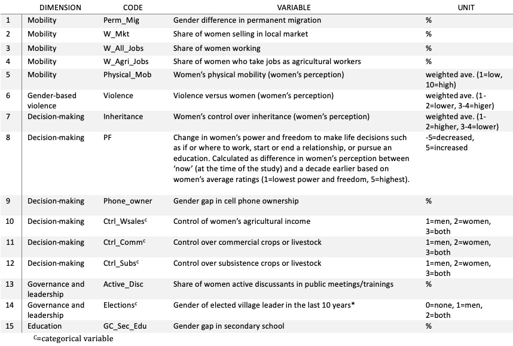
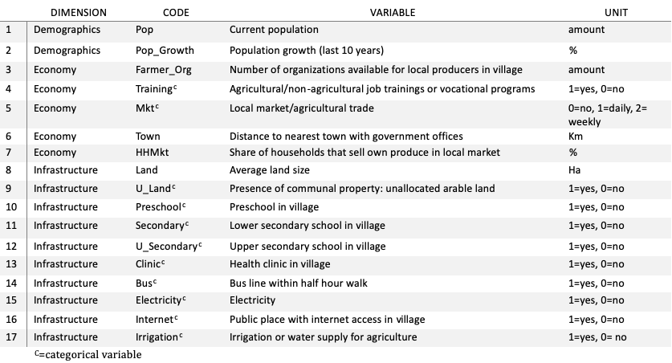

```{r setup, include=FALSE}
knitr::opts_chunk$set(echo = TRUE)
```

This tutorial provides a quick introduction to multivariate analysis and variance partitioning. The tutorial targets scientists, students, and practitioners working with gender and agriculture that have previous knowledge of the [R software](https://cran.r-project.org/). 

It is the accompanying tutorial for the article **Towards gender-inclusive innovation: Assessing local conditions for agricultural targeting.** by Diana E. Lopez, Romain Frelat and Lone B. Badstue published in 2022 in Plos One, [DOI 10.1371/journal.pone.0263771](https://doi.org/10.1371/journal.pone.0263771). See the *Materials and Methods* section of the article for more details about the data and the method.


# Preliminaries

The analysis require the packages [ade4 (v ≥ 1.7)](http://pbil.univ-lyon1.fr/ADE-4) and [vegan (v ≥ 2.5)](https://github.com/vegandevs/vegan).

```{r, message=FALSE}
library(ade4)
library(vegan)
```

If you get an error message, check that the R packages `ade4` and `vegan` are installed correctly. If not, use the command: `install.packages(c("ade4", "vegan"))`.

We use a selection of 32 variables from the [GENNOVATE](https://gennovate.org/) dataset on maize and wheat sampling.  

The full GENNOVATE methodology and data collection instruments are available as a pdf [here](https://gennovate.org/wp-content/uploads/2018/10/GENNOVATE-Methodology_Feb2018_FINAL.pdf). We also provide an [Excel file](https://github.com/rfrelat/GenderClimate/raw/main/GennovateQuestions.xlsx) with the question codes that informed the variables (to be read together with the methodology).    

The dataset containing the 32 variables is avalaible in the csv file  `GennovateWheatMaize.csv`, available for download [here](https://github.com/rfrelat/GenderClimate/raw/main/GenderClimateGennovate.zip)

The variable selection followed a process that included data curation, cleaning and exploration. The first dataset included 135 variables. We used Microsoft Excel to organize and clean the data which was later explored in R using visualization techniques (i.e. histograms, barplots, and pairwise plots). After several iterations, and once data was coherent and ready to be compared across the 70 villages, we selected the final 32 variables. The selection was based on the availability (and consistency) of information as well as other criteria for variable selection in multivariate analysis (MVA) (see section 1.4). The final selection comprised categorical and numerical variables. Therefore, we used the Hill and Smith method (Hill & Smith, 1976) which—although similar to Principal Component Analysis (PCA)—further allows analysis with both categorical and numerical variables (Kiers, 1994). This method helped to simplify the original large variables into Principal Components (PCs) while maintaining the maximum of the variability in the datasets.  

The **goal** of this tutorial is to **present the construction of the principal components (PCs) for ‘gender climate’, ‘opportunity’, and ‘connectivity’ through the use of MVA**. Special attention is put in the interpretation of results. Additional variance partitioning is also conducted. 


# 1. Load and visualize the Gennovate data

## 1.1 Load the dataset

Make sure you [file](https://github.com/rfrelat/GenderClimate/raw/main/GennovateWheatMaize.csv) `GennovateWheatMaize.csv` is in your working directory, and load it in R

```{r}
tab <- read.csv("GennovateWheatMaize.csv", 
                row.names = 1, stringsAsFactors = TRUE)
dim(tab)
names(tab)
```

The dataset stored in the variable `tab` is made of 32 variables + 2 identification variables (country and crop) (in columns) describing 70 villages (in rows). The names of the variables is shown by the command `names(tab)` and will be described later in this tutorial.

## 1.2 Visualize categorical variables

The function `table()` shows the composition of a categorical variable (also called a contingency table), in other words, the number of rows (=village) per category.

```{r}
table(tab$Country)
table(tab$crop)
```
In the dataset, there are 70 villages: 4 from Afghanistan (AF), 6 from Bangladesh (BD), 18 from Ethiopia (ET), 12 from India (IN), 3 from Morocco (MO), 2 from Malawi (MW), 6 from Mexico (MX), 4 from Nigeria (NI), 6 from Nepal (NP), 7 from Pakistan (PK), 4 from Tanzania (TZ), 4 from Uzbekistan (UZ), and 4 from Zimbabwe (ZW). In total 43 villages had wheat as a staple crop, and 27 maize as a staple crop. 

We can visualize the number of village per staple crop with the function `barplot()`.

```{r}
#Set the color per crop
colCrop <- c("chartreuse3", "darkgoldenrod1")
barplot(table(tab$crop), col=colCrop,
        xlab="Crop", ylab="Number of villages")
```

We can further check the relation between the staple crop and the country using the same function `table()` and `barplot()`.

```{r, width=8}
#Compute the contingency table
table(tab$crop, tab$Country)

#Visualize the contingency table
barplot(table(tab$crop, tab$Country), col=colCrop,
        xlab="Crop", ylab="Number of villages",
        cex.names = 0.9)
```

The 6 villages surveyed in Mexico rely on maize production, and the 12 villages surveyed in India rely on wheat production. In Nepal and in Ethiopia, the sampling was divided into half the villages that mostly rely on maize production and half on wheat.  

## 1.3 Visualize numerical variables

The best way to summarize a numerical variable is given by the function `summary()` which provides the minimum and maximum value, the average, and quantiles (1st quartile, median and 3rd quartile).

```{r}
summary(tab$Pop)
```

In our case, the villages have in average 4993 inhabitants, the smallest village had only 240 inhabitants, while the largest counted 35 000 inhabitants. The quartiles indicate that 25% of the villages had less than 1716 inhabitants, and 25% of the village had more than 6000 inhabitants. There were as many villages (35) with more than 3000 inhabitants, than with less than 3000 inhabitants.

We can visualize the distribution of the population per village using the `boxplot()` function (or `hist()` function). 

```{r}
boxplot(tab$Pop, ylab="Population")
```

The quartiles and the median are represented by the box, while the *moustache* shows the values that fit into the expected range (1.5 inter-quartile range). The circles represent the values that could be considered as outliers. We can clearly see from the boxplot that most villages have low number of inhabitants (less than 6000), and the village with 35000 is extreme.  

Similarly, it is possible to cross a numerical variable with a categorical variable. For example, here we see if the village size is related to crop type.

```{r}
tapply(tab$Pop,tab$crop, summary)
boxplot(tab$Pop~tab$crop, ylab="Population", xlab="Crop")
```

Villages depending on maize are, in average, slighlty smaller than villages depending on wheat; 
but the differences are small (median of 2560 compared to 3344).

## 1.4 Selection of variables and further exploratory analysis

It is strongly recommended that readers continue exploring the dataset in a similar way as previously described for the variables `Country`, `Crop`, and `Pop`. Exploratory analysis is a good way to get an understanding of the dataset and it is a **necessary step to select the relevant variables before pursuing multivariate analysis**

The selection of variables is a critical step. Below are some recommendations that are common to all dataset before any multivariate analysis.  
**Variables have to be generic** enough so that most of the villages are concerned (e.g. if only one village have access to post-harvesting tools over the whole samples, no variable about post-harvesting will be selected, unless your initial objective has a special interest about post-harvesting).   
**Remove obviously correlated variables**. For example, the population growth is highly correlated with the population size. If both variables are included, double weight will be given to this characteristic. A good solution to remove this correlation is to compute percentages: the percentages of population growth over the population size is another information about population growth, not directly correlated with the population size.    
**Remove the geographic variables** or other variables that are a proxy. For example, villages from a given country have different characteristics but if you include country as a variable, you will artificially favour country characteristics to be the main source of variations.  
**Include enough variables** to be able to depict all the diversity that we want to take into account. If you have three variables (e.g. land size, access to primary education, distance to town), you don’t need multivariate analysis to help you reduce the complexity, but this relative simplicity from the 3 variables won’t capture the complexity of the dimension you want to measure.

# 2.Gender climate

## 2.1 Selection of gender climate variables

```{r}
gendervar <- c("W_Mkt", "W_Agri_Jobs", "W_All_Jobs", 
           "Ctrl_Wsales", "Perm_Mig", "Phone_owner", 
           "GC_Sec_Edu", "Elections", "Active_Disc", 
           "Violence", "Physical_Mob", "PF", 
           "Ctrl_Comm", "Ctrl_Subs", "Inheritance")
#Subset variables for gender climate
gc <- tab[,gendervar]
dim(gc)
```

A MVA is carried out on the `r ncol(gc)` selected variables that described the  `r nrow(gc)` villages. See the *Materials and Methods* section of the article for more details about the gender variables organized according to specific dimensions of gender norms. Below an overview.  



## 2.2 Multivariate methods for mixed numerical and categorical variables

The dataset includes 11 numerical variables and 4 categorical variables, therefore we used Hill and Smith' method to carry out multivariate analysis.

```{r}
#multivariate analysis
mvar.gc <- dudi.hillsmith(gc, scannf = FALSE, nf=3)
```

## 2.3 Selection of relevant Principal components
The eigen values represent the percentage of additional variance explained by the successive PCs and are often represented as a barplot.

```{r}
barplot(mvar.gc$eig/sum(mvar.gc$eig)*100,
        ylab="% variance explained",
        xlab="Principal components")
```

The figure above indicates the number of principal components that efficiently summrarize the maximum percentage of information in the lowest number of components. In this case, we see a large drop of variance explained between the first PC (18%) and the second PC (11%). Therefore we selected only the first PC as representing the gender climate.

## 2.4 Interpretation of the selected Principal components

```{r, echo=FALSE}
mvar.gc$co[,1] <- -mvar.gc$co[,1]
mvar.gc$li[,1] <- -mvar.gc$li[,1]
newlabgc <- c()
for (i in gendervar){
  if(is.factor(gc[,i])){
    newlabgc <- c(newlabgc, paste(i, levels(gc[,i]), sep="_"))
  } else {
    newlabgc <- c(newlabgc, i)
  }
}
row.names(mvar.gc$co) <- newlabgc
```

```{r}
dotchart(sort(mvar.gc$co[,1]), pch=16, cex = 0.6,
         labels = row.names(mvar.gc$co)[order(mvar.gc$co[,1])],
         xlab="PC1 loadings")
abline(v=0)
```

The first principal component (PC1) provides a **composite score of gender climate (GC)** with high values for relaxed gender climate and low values for a restrictive gender climate. The most important variables contributing to a relaxed GC are women’s control over their own agricultural income, women’s power and freedom to make life decisions, the presence of women sellers in local markets, women’s freedom of mobility, active female discussants in public meetings and trainings, cell phone ownership, as well as women working for pay (both in agricultural and non-agricultural jobs). Women's control over commercial crop and livestock has the highest loading, but it corresponds to only one village in Nepal.  

On the contrary, the variables that contribute to a restrictive GC include men’s control over women’s agricultural income, men’s sole control over commercial and subsistence crops or livestock, and permanent migration. 

## 2.5 Visualize gender climate per country cohort


```{r}
#Define color per country-crop
colCC <- rainbow(nlevels(tab$Country))
boxplot(mvar.gc$li[,1]~tab$Country, 
        ylab="Gender climate", xlab="",
        col=colCC, las=2)
abline(h=0)
```

In terms of country cohorts, the most restrictive GC is in study villages from Afghanistan, Pakistan, and Bangladesh whereas villages in Nepal, Mexico, Nigeria, and Zimbabwe exhibited a relatively more relaxed GC. Large variability is found in Nepal (with the most equal village, and some villages’ score close to 0) and in Uzbekistan with villages with positive and negative scores.


# 3. Complementary scores: Opportunity and Connectivity

## 3.1 Selection of variables for ‘opportunity’ and ‘connectivity’

```{r}
csvar <- c("Irrigation", "Pop", "Pop_Growth", 
            "HHMkt", "Mkt", "U_Land", 
           "Town", "Preschool", "U_Secondary", 
           "Secondary", "Clinic", "Training", 
           "Bus", "Electricity", "Internet", 
           "Land", "Farmer_Org")
#Subset variables for complementary scores
cs <- tab[,csvar]
dim(cs)
```

A MVA  is carried out on the `r ncol(cs)` selected variables that describe `r nrow(cs)` villages. See the *Materials and Methods* section of the article for more details about the opportunity and connectivity variables organized according to specific dimensions. Below an overview. 



## 3.2 Multivariate methods 

Similar to previous section, we used Hill and Smith' method to carry out multivariate analysis on our dataset that contains 6 numerical variables and 11 categorical variables.

```{r}
#multivariate analysis
mvar.cs <- dudi.hillsmith(cs, scannf = FALSE, nf=3)
```

## 3.3 Selection of relevant Principal components
The eigen values represent the percentage of additional variance explained by the successive PCs and are often represented as a barplot.

```{r}
barplot(mvar.cs$eig/sum(mvar.cs$eig)*100,
        ylab="% variance explained",
        xlab="Principal components")
```

The figure above indicates the number of principal components that efficiently summarize the maximum percentage of information in the lowest number of components. In this case, we see a large drop of variance explained between the second PC (13%) and the third PC (9%). Therefore, we selected the two first PCs that, together, explained 27% of the variability. These also represent what we called ‘opportunity’ and ‘connectivity’ in the article.


## 3.4 Interpretation of the first Principal Component ‘Opportunity’

```{r, echo=FALSE}
mvar.cs$co[,1] <- -mvar.cs$co[,1]
mvar.cs$li[,1] <- -mvar.cs$li[,1]
```

```{r}
dotchart(sort(mvar.cs$co[,1]), pch=16, xlab="PC1 loadings",
         labels = row.names(mvar.cs$co)[order(mvar.cs$co[,1])],
         cex = 0.5)
abline(v=0)
```

The first principal component (PC1) provides a **composite score of opportunity** with high values for larger villages with better commercial and job training opportunities, and low values for smaller villages with less opportunities.  

Villages with high scores were primarily characterized by their access to (agricultural/non-agricultural) job trainings or vocational programs, high share of households selling their agricultural produce in local markets, high population, and access to upper secondary school. Villages with low scores were mainly characterized by absence of/lack of access to local markets, health clinics, secondary schools, and to job trainings or vocational programs.  

```{r}
boxplot(mvar.cs$li[,1]~tab$Country, 
        ylab="Opportunity", xlab="",
        col=colCC, las=2)
abline(h=0)
```

This score has very high heterogeneity within countries probably due to maximum diversity sampling but also to important economic and demographic differences within the same country areas (refer to Article). Despite the large variability within country cohorts, on average, the villages with better ‘opportunity’ were found in Nigeria, Uzbekistan, Afghanistan and Ethiopia; while those with lower opportunities were from Morocco, Tanzania, and India.


## 3.5 Interpretation of the second Principal Component ‘Connectivity’

```{r}
dotchart(sort(mvar.cs$co[,2]), pch=16, 
         xlab="PC2 loadings", cex = 0.5, 
         labels = row.names(mvar.cs$co)[order(mvar.cs$co[,2])])
abline(v=0)
```   


The second principal component (PC2) provides a **composite score of connectivity** with high values for villages with better access to communication and infrastructure services and low values for villages with less access.    

Villages with high scores were mainly characterized by internet access, the presence of a secondary school, electricity, and a bus line within a 30-minute walk. Villages with low scores reported limited or no access to electricity, to an upper secondary school or bus line, greater distance to the nearest town with government offices, and rapid population growth. Overall, high scores for connectivity were more associated to good infrastructure than to favorable economic opportunities.
  
```{r}
boxplot(mvar.cs$li[,2]~tab$Country, 
        ylab="Connectivity", xlab="",
        col=colCC, las=2)
abline(h=0)
```

On average, the study villages from Uzbekistan and Nepal appeared to be better connected than villages from Zimbabwe or Ethiopia. 

# 4. Pairwise correlation

Before making further analysis, we have to combine all the score in a single `data.frame`. The **score** of each village is saved in the variable `li`.  

```{r}
comp <- data.frame(
  "Gender climate"=mvar.gc$li[,1],
  "Opportunity"=mvar.cs$li[,1],
  "Connectivity"=mvar.cs$li[,2],
  "Country"=tab$Country
)
```

## 4.1 Gender climate and Opportunity

We can represent the pairwise relationship between gender climate and opportunity can be represented with the function `plot` and tested with the function `cor.test()`. 

```{r}
plot(comp$Gender.climate, comp$Opportunity, 
     xlab="Gender climate", ylab="Opportunity")
cor.test(comp$Gender.climate, comp$Opportunity)
```

As evidenced visually and also confirmed by the correlation test, there is no relationship between gender climate and opportunity. This absence of relationship can be better visualized when grouping the villages by country (using the function `s.class()`.

```{r}
par(oma=c(1,1,0,1))
s.class(comp, fac = comp$Country,
        col = colCC, xax=1, yax=2, grid=FALSE)
mtext("Gender", side = 1, line = 0, outer = TRUE)
mtext("Opportunity", side = 2, line = 0, outer = TRUE)
```


## 4.2 Gender climate and connectivity

```{r}
cor.test(comp$Gender.climate, comp$Opportunity)

par(oma=c(1,1,0,1))
s.class(comp, fac = comp$Country,
        col = colCC, xax=1, yax=3, grid=FALSE)
mtext("Gender", side = 1, line = 0, outer = TRUE)
mtext("Connectivity", side = 2, line = 0, outer = TRUE)

```


Similarly, we can see that there is no relationship between connectivity and gender climate.  


## 5 Variance partitioning

Variance partitioning (Borcard et al. 1992) allows the comparison of multiple variables (or set of variables) in explaining the variance of a given variable. We wanted to see what is the relative influence (i.e., explanatory power) of connectivity, opportunity, and geographic context on gender climate.

It is important to note that the shared explanatory power between two variables doesn’t indicate interaction but a common share of explained variance, most probably due to collinearity between the two variables.


```{r}
var <- varpart(comp$Gender.climate, ~Opportunity, ~Connectivity, 
               ~Country, data=comp)
```


```{r}
par(cex=0.6)
plot(var, Xnames=c("Opportunity", "Connectivity", "Country"),
     bg=rainbow(4))
```


# References

Borcard, D.P., Legendre, P., Drapeau, P. 1992. Partialling out the spatial component of ecological variation. Ecology. 73(3), 1045-1055.  

Hill, M. O., and Smith. A. J. E. 1976. Principal component analysis of taxonomic data with multi-state discrete characters. Taxon, 25, 249-255.

Kiers, H. A. L. 1994. Simple structure in component analysis techniques for mixtures of qualitative ans quantitative variables. Psychometrika, 56, 197-212.

Lopez D.E., Frelat R., Badstue L.B. 2022. Towards gender-inclusive innovation: Assessing local conditions for agricultural targeting. PLoS ONE 17(3): e0263771. [DOI 10.1371/journal.pone.0263771](https://doi.org/10.1371/journal.pone.0263771)